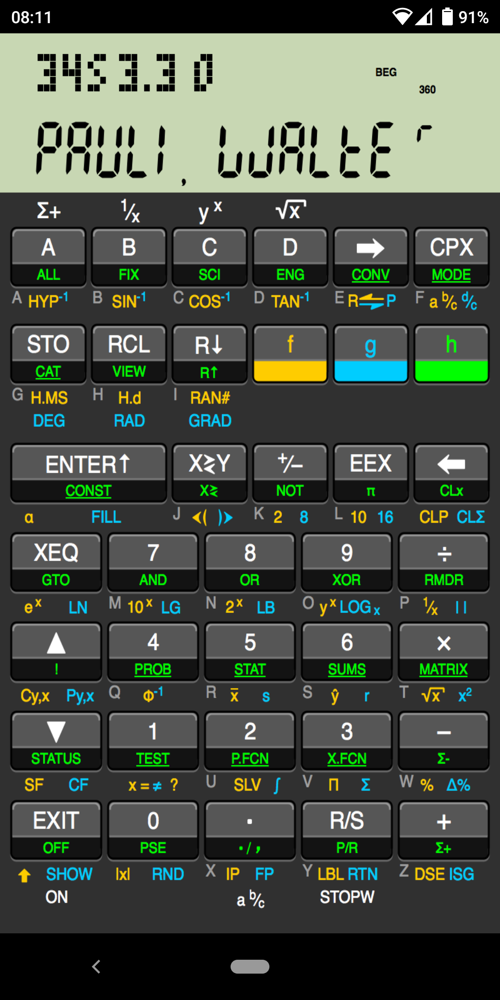

# awp34s

WP 34s Calculator Port to Android

Port of the the WP 34S calculator (open source firmware for the HP 30b/20b
calculators) to Android.

Install latest tag directly from GooglePlay at:
https://play.google.com/store/apps/details?id=com.odkq.wp34s

You can build a debug .apk and install it manually in the device following the
instructions at [BUILDING.md](BUILDING.md)

Information on WP 34S:

  - [Wikipedia Entry](https://en.wikipedia.org/wiki/HP_30b#WP_31S,_WP_34S_and_WP_34C)
  - [SourceForge Project](https://sourceforge.net/projects/wp34s/)
  - [Online Seller](https://commerce.hpcalc.org/34s.php)
  - [Original Wiki](http://www.wiki4hp.com/doku.php?id=34s:repurposing_project)

At [this directory on SF](https://sourceforge.net/projects/wp34s/files/doc/)
you will find a beginners guide
[WP_34S_Beg_Guide.pdf](https://pilotfiber.dl.sourceforge.net/project/wp34s/doc/WP_34S_Beg_Guide.pdf)
and a comprehensive manual
[Manual_wp_34s_3_1.pdf](https://deac-ams.dl.sourceforge.net/project/wp34s/doc/Manual_wp_34s_3_1.pdf")
The manuals apply in its entirety to this port.

The WP 34S project has an IPhone app but no Android app. Wanting to learn
about Android and NDK development, I did this.

I labeled this as a port rather than as an emulator as it is not
emulating the CPU of the physical device. The firmware itself originally
written in portable C is compiled along with the
Android Native Development Kit (NDK).

The code for the interface and modifications to the WP 34s firmware are
Free Software and released under the GNU Public License v3, as the WP
34S code itself.

Thanks to Walter Bonin, Paul Dale, Marcus von Cube and the rest of the WP 34S
contributors for the excelent calculator.
